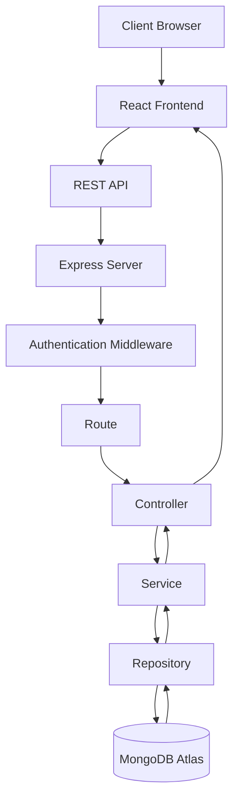
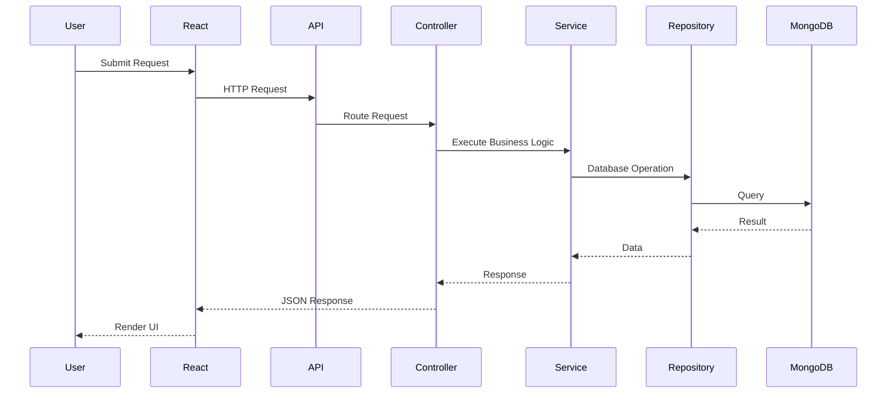
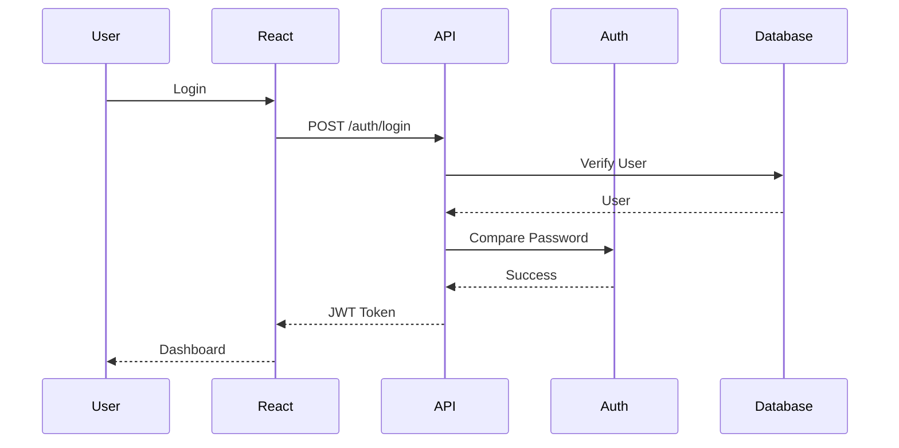

# Software Architecture Document (SAD)

# LeadFlow CRM

Version: 1.0

Status: Planning

Author: Manoj Thamke

Date: August 2026

---

# 1. Purpose

This document defines the software architecture for LeadFlow CRM.

It describes the architectural decisions, module organization, request flow, design principles, and engineering standards that guide the implementation of the application.

The primary goal is to create a scalable, maintainable, secure, and production-ready application.

---

# 2. Architectural Goals

The architecture has been designed with the following goals:

- Scalability
- Maintainability
- Readability
- Testability
- Security
- Separation of Concerns
- Feature Isolation
- Production Readiness

Every architectural decision in this document supports one or more of these goals.

---
# 3. Architecture Decision Records (ADR)

## ADR-001

Decision

Use Modular MVC Architecture.

Status

Accepted

Reason

The application contains multiple independent business domains such as Authentication, Users, Leads, Notes, Activities, and Dashboard.

Keeping every feature inside its own module improves maintainability and reduces coupling.

---

## ADR-002

Decision

Use a Service Layer.

Status

Accepted

Reason

Controllers should only coordinate requests and responses.

Business rules belong inside services.

This improves readability, testing, and reuse.

---

## ADR-003

Decision

Use Repository Pattern.

Status

Accepted

Reason

Database operations should remain isolated from business logic.

Repositories provide a single point of communication with MongoDB.

This makes the application easier to maintain and test.

---

## ADR-004

Decision

Use REST API.

Status

Accepted

Reason

REST is widely supported, simple to consume, and suitable for the requirements of LeadFlow CRM.

---

## ADR-005

Decision

Use JWT Authentication.

Status

Accepted

Reason

JWT provides stateless authentication suitable for modern web applications.

---

## ADR-006

Decision

Use MongoDB.

Status

Accepted

Reason

Lead information contains flexible business data that benefits from MongoDB's document model.

# 4. Architecture Overview

LeadFlow CRM follows a **Modular MVC Architecture** enhanced with a **Service Layer** and **Repository Pattern**.

The application is organized into independent feature modules such as Authentication, Users, Leads, Notes, Activities, and Dashboard.

Each module encapsulates its own routes, controllers, services, repositories, models, and validators.

This architecture provides:

- High cohesion within modules
- Low coupling between modules
- Clear separation of concerns
- Easy scalability
- Better maintainability
- Improved testability

The application follows a layered request flow where each layer has a single responsibility.

# 5. High-Level Architecture



# 6. Layered Architecture

LeadFlow CRM is divided into independent layers.

Each layer has a clearly defined responsibility.

| Layer | Responsibility |
|---------|----------------|
| Client | User Interface |
| Routes | Endpoint Mapping |
| Controllers | Handle HTTP Request & Response |
| Services | Business Logic |
| Repositories | Database Communication |
| Models | MongoDB Schema Definitions |
| Database | Persistent Data Storage |

Business logic never directly communicates with the database.

All database operations are performed through repositories.

# 7. Layer Responsibilities

## Route Layer

Responsibilities

- Register endpoints
- Attach middleware
- Forward requests to controllers

Routes must not contain business logic.

---

## Controller Layer

Responsibilities

- Receive HTTP requests
- Validate request context
- Call services
- Return HTTP responses

Controllers remain thin.

---

## Service Layer

Responsibilities

- Execute business rules
- Coordinate repositories
- Perform calculations
- Enforce business constraints

Services never communicate directly with HTTP objects.

---

## Repository Layer

Responsibilities

- Execute MongoDB queries
- Abstract data access
- Return domain objects

Repositories never contain business logic.

---

## Model Layer

Responsibilities

- Define MongoDB schema
- Configure indexes
- Define relationships

# 8. Request Lifecycle

A request follows the sequence below.



# 9. Authentication Flow

LeadFlow CRM uses stateless authentication based on JSON Web Tokens (JWT).

## Authentication Process

1. User submits email and password.
2. Credentials are validated.
3. Password is verified using bcrypt.
4. JWT Access Token is generated.
5. Token is returned to the client.
6. Client stores the token securely.
7. Every protected request includes the token in the Authorization header.
8. Authentication middleware verifies the token before allowing access.



# 10. Authorization Strategy

LeadFlow CRM implements Role-Based Access Control (RBAC).

The system currently supports two roles:

## Administrator

Permissions

- Manage Users
- View All Leads
- Create Leads
- Update Leads
- Delete Leads
- Assign Leads
- View Dashboard Analytics

---

## Member

Permissions

- View Assigned Leads
- Update Assigned Leads
- Add Notes
- View Activity Timeline

Members cannot manage users or delete leads.

Authorization is enforced on both the frontend and backend.

# 11. Module Design

The application is organized into independent feature modules.

Current modules include:

- Authentication
- Users
- Leads
- Notes
- Activities
- Dashboard

Each module owns its complete implementation.

Example:

```text
leads/

lead.routes.js

lead.controller.js

lead.service.js

lead.repository.js

lead.model.js

lead.validator.js
```

This structure improves maintainability and enables independent feature development.

# 12. Backend Folder Structure

```text
server/

src/

│

├── app.js

├── server.js

│

├── config/

│

├── middleware/

│

├── modules/

│   ├── auth/

│   ├── users/

│   ├── leads/

│   ├── notes/

│   ├── activities/

│   └── dashboard/

│

├── shared/

│

├── utils/

│

└── tests/
```

Feature modules contain all implementation related to that feature.

# 13. Frontend Folder Structure

```text
client/

src/

│

├── app/

├── assets/

├── components/

├── features/

│   ├── auth/

│   ├── dashboard/

│   ├── leads/

│   ├── notes/

│   └── users/

├── hooks/

├── layouts/

├── routes/

├── services/

├── utils/

└── types/
```

The frontend follows a feature-based organization similar to the backend.

# 14. Design Principles

LeadFlow CRM follows the following engineering principles:

- Single Responsibility Principle
- Separation of Concerns
- Don't Repeat Yourself (DRY)
- Keep It Simple (KISS)
- Feature Isolation
- RESTful API Design
- Secure by Default
- Reusable Components
- Modular Development
- Clean Code Practices

# 15. Error Handling Strategy

The application uses centralized error handling.

The strategy consists of:

- Global Error Middleware
- Async Request Handler
- Standardized Error Responses
- HTTP Status Codes
- Structured Error Messages

Controllers never contain repetitive try-catch blocks.

Errors propagate through middleware and are transformed into consistent API responses.

# 16. Validation Strategy

All incoming requests are validated before reaching controllers.

Validation includes:

- Required Fields
- Data Types
- String Length
- Email Format
- Business Rules

Invalid requests return descriptive validation errors without executing business logic.

# 17. Configuration Management

Application configuration is managed using environment variables.

Examples include:

- Server Port
- MongoDB Connection String
- JWT Secret
- Token Expiration
- Client URL

Sensitive information is never hardcoded into the source code.

# 18. Security Considerations

Security measures include:

- Password Hashing (bcrypt)
- JWT Authentication
- Role-Based Authorization
- Input Validation
- CORS Configuration
- HTTP Security Headers
- Environment Variable Protection
- Secure Password Storage

These measures help protect the application against common security risks.

# 19. Scalability & Future Evolution

The chosen architecture supports future expansion without major restructuring.

Potential future enhancements include:

- Email Notifications
- File Attachments
- AI Lead Scoring
- Calendar Integration
- Real-Time Updates
- Multi-Tenant Support
- Audit Reports
- Mobile Application

New modules can be added without affecting existing modules because of the modular architecture.

