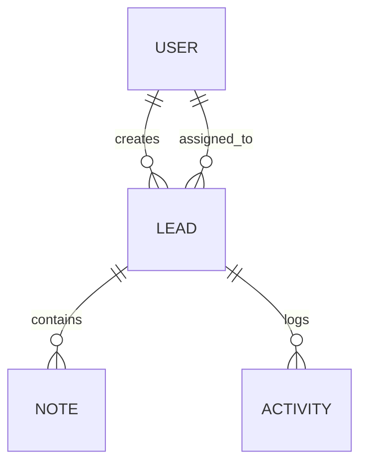

# Database Design Document (DDD)

# LeadFlow CRM

Version: 1.0

Status: Planning

Author: Manoj Thamke

Date: August 2026

---

# 1. Purpose

This document defines the database architecture for LeadFlow CRM.

It specifies the collections, relationships, indexing strategy, validation rules, and design principles used to build a scalable and maintainable MongoDB database.

The goal is to support efficient CRUD operations, secure data storage, and future scalability.

---

# 2. Database Selection

## Selected Database

MongoDB

---

## Reason for Selection

MongoDB was selected because:

- Flexible document-based schema
- Fast development for evolving business requirements
- Excellent integration with Mongoose
- Supports indexing and aggregation
- Suitable for CRM-style applications

---

# 3. Database Design Principles

The database follows these principles:

- Keep documents focused on a single responsibility
- Use references for relationships
- Avoid unnecessary document growth
- Normalize where appropriate
- Denormalize only when beneficial
- Index frequently queried fields
- Store timestamps for auditability
- Support future scalability

---

# 4. Collections

The system contains four primary collections.

| Collection | Purpose |
|------------|----------|
| Users | System users |
| Leads | Customer leads |
| Notes | Collaboration notes |
| Activities | Audit trail |

Dashboard analytics are computed dynamically and therefore do not require a dedicated collection.

---

# 5. Entity Relationship Diagram

# 6. Users Collection

Purpose

Stores application users.

Fields

| Field | Type | Required | Description |
|--------|------|----------|-------------|
| _id | ObjectId | Yes | Primary Key |
| name | String | Yes | User full name |
| email | String | Yes | Unique email |
| password | String | Yes | Hashed password |
| role | Enum | Yes | ADMIN / MEMBER |
| isActive | Boolean | Yes | User status |
| createdAt | Date | Yes | Creation timestamp |
| updatedAt | Date | Yes | Last update timestamp |

Indexes

- email (unique)

Validation

- Email must be unique.
- Password is stored only after hashing.
- Role must be ADMIN or MEMBER.

# 7. Leads Collection

Purpose

Stores all customer leads.

Fields

| Field | Type | Required | Description |
|--------|------|----------|-------------|
| _id | ObjectId | Yes | Primary Key |
| firstName | String | Yes | Customer first name |
| lastName | String | Yes | Customer last name |
| email | String | Yes | Customer email |
| phone | String | No | Phone number |
| company | String | No | Company name |
| status | Enum | Yes | Lead status |
| priority | Enum | Yes | Lead priority |
| source | String | No | Lead source |
| assignedTo | ObjectId | No | Assigned user |
| createdBy | ObjectId | Yes | Creator |
| createdAt | Date | Yes | Created timestamp |
| updatedAt | Date | Yes | Updated timestamp |

Status Values

- NEW
- CONTACTED
- QUALIFIED
- PROPOSAL
- NEGOTIATION
- WON
- LOST

Priority Values

- LOW
- MEDIUM
- HIGH

Indexes

- status
- assignedTo
- company
- priority
- createdAt

# 8. Notes Collection

Purpose

Stores notes related to leads.

Fields

| Field | Type | Required |
|--------|------|----------|
| _id | ObjectId | Yes |
| leadId | ObjectId | Yes |
| userId | ObjectId | Yes |
| content | String | Yes |
| createdAt | Date | Yes |
| updatedAt | Date | Yes |

Indexes

- leadId

# 9. Activities Collection

Purpose

Stores every important action performed in the system.

Examples

- Lead Created
- Lead Updated
- Lead Assigned
- Status Changed
- Note Added
- Lead Deleted

Fields

| Field | Type | Required |
|--------|------|----------|
| _id | ObjectId | Yes |
| leadId | ObjectId | Yes |
| userId | ObjectId | Yes |
| action | String | Yes |
| description | String | Yes |
| metadata | Object | No |
| createdAt | Date | Yes |

Indexes

- leadId
- createdAt

# 10. Relationships

One User can create many Leads.

One User can be assigned many Leads.

One Lead can contain many Notes.

One Lead can contain many Activities.

Relationship Summary

User (1) ---- (*) Leads

Lead (1) ---- (*) Notes

Lead (1) ---- (*) Activities

# 11. Index Strategy

Indexes improve query performance.

## Users

- email

## Leads

- status
- assignedTo
- priority
- company
- createdAt

## Notes

- leadId

## Activities

- leadId
- createdAt

These indexes support searching, filtering, assignment, dashboard statistics, and activity history.

# 12. Data Integrity

The application enforces integrity through:

- Required fields
- Enum validation
- Reference validation
- Unique email addresses
- Automatic timestamps
- Server-side validation

# 13. Future Evolution

The current design supports future additions without restructuring.

Potential future collections include:

- Notifications
- Attachments
- Tags
- Organizations
- Pipelines
- Comments
- Email Logs

